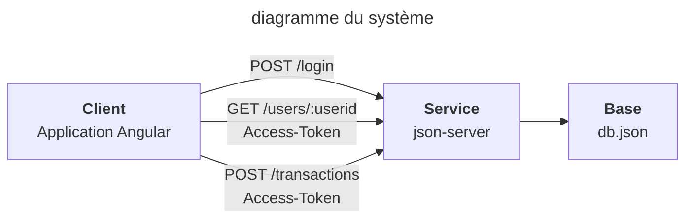
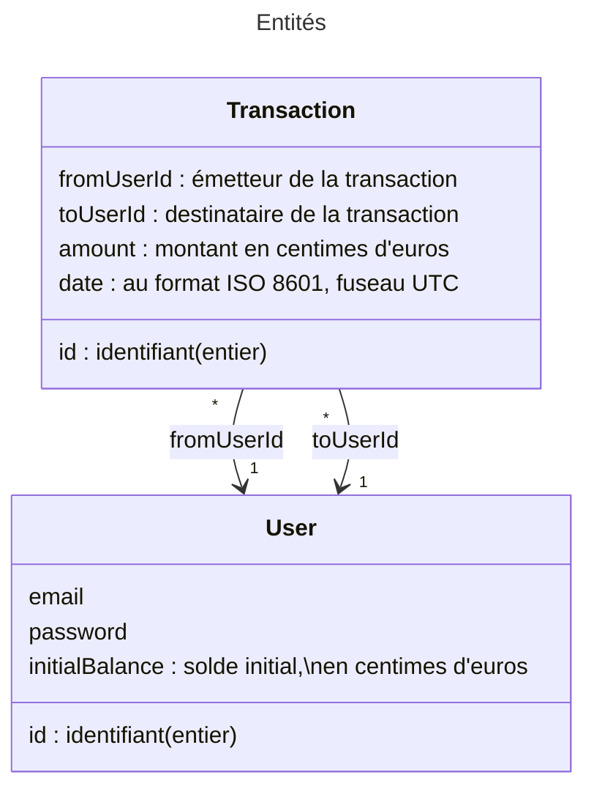

# Entretien technique - Angular

Projet généré avec [Angular CLI](https://github.com/angular/angular-cli) version 16.2.14.

## Construction du livrable

Lancer la commande `ng build` pour construire le projet. L'artifact généré se trouvera dans le répertoire `dist/`.

## Lancement des tests unitaires

Lancer la commande `ng test` pour exécuter les tests unitaires via [Karma](https://karma-runner.github.io).

## Application

L'application Angular permet à des clients d'effectuer des transactions entre leurs comptes, à l'aide d'une API très simple.

Le système gère des comptes utilisateurs disposant d'un solde initial, et des transactions entre leurs comptes :

Formats des données gérées par le service et ses API :

- Les montants `initialBalance` et `amount` sont des entiers représentant des centimes d'euros (eg `12345`), et doivent être affichés en euros aux usagers (eg `123,45 €`)
- Les dates des transactions sont au format [ISO 8601](https://fr.wikipedia.org/wiki/ISO_8601) sur fuseau UTC (eg `2024-06-01T12:30:00Z`), et doivent être converties selon le fuseau horaire du navigateur de l'usager (eg `Samedi 1er juin 2024 à 14h30` en fuseau `Europe/Paris`)

## Lancement de l'application

## Utilisation

La commande `npm run start` lance l'application.

- Le client est disponible sur <http://localhost:4200/>
- L'API est disponible sur <http://localhost:3000/>
- Les opérations suivantes sont disponibles pour tous les utilisateurs:
  - POST /login
  - POST /register
  

- Les opérations suivantes sont disponibles pour les utilisateurs connectés uniquement:
  - GET /users
  - GET /users/:id
  - GET /transactions
  - POST /transactions/:id

Fonctionnement de l'API d'authentification : <https://www.npmjs.com/package/json-server-auth>

Fonctionnement des API métiers : <https://www.npmjs.com/package/json-server>

L'application se rechargera automatiquement en cas de changement du code source.

## Instructions

**L'architecture logicielle est entièrement modifiable par le candidat.
Chaque décision doit pouvoir se justifier.**

### [code] Intégrer l'authentification

L'utilisateur doit pouvoir s'authentifier auprès du service à l'aide de son adresse email et de son mot de passe afin de pouvoir utiliser les API.

⚠️Il est impératif que le token JWT récupéré suite à l'authentification soit protégé contre toute attaque (XSS, CSRF, etc) : implémenter les mesures de sécurité côté Angular et indiquer toute autre mesure utile externe.

### [code] Intégrer le Design System de l’État

L'application doit respecter le [Design System de l’État](https://www.systeme-de-design.gouv.fr/prise-en-main-et-perimetre/), ne pas hésiter à regarder les [portages en cours](https://www.systeme-de-design.gouv.fr/communaute/portages-en-cours/).

### [code] Fonctionnalités

Implémenter les fonctionnalités suivantes :

- Pour l'usager anonyme :
  - Formulaire d'authentification et bouton de connexion
- Pour l'usager authentifié :
  - Affichage de son compte, avec notamment :
    - Son adresse email, accessible dans le contenu de l'access token JWT
    - Son solde à jour, calculé à partir de son solde initial et des transactions
    - La liste de toutes les transactions qui le concernent (en débit et en crédit), avec tri, filtres et pagination
  - Soumission d'une nouvelle transaction, à partir de l'adresse email du destinataire, avec vérification de suffisance du solde de l'émetteur
  - Un menu correspondant aux deux fonctions précédentes

### [code] Tests unitaires

Implémenter les tests unitaires nécessaires.

[Karma](https://karma-runner.github.io) est le framework de test utilisé par défaut mais le choix du framework de test est libre.

### [code] Exceptions

Mettre en place un système de gestion des exceptions (appel API, erreur action utilisateur, etc...).

### [code] Accessibilité

Rendre l'application accessible avec un lecteur tel quel [AInspector](https://addons.mozilla.org/fr/firefox/addon/ainspector-wcag/).

### [conception] Architecture logicielle

- **Problème de la double transaction**

Il peut arriver qu'un usager soumette deux fois la même transaction par erreur (par exemple, lors d'une perte du réseau entre l'envoi de la transaction et de son acquittement).

Comment se prémunir contre ce type de problème et quels sont les impacts sur le client ?

- **Approche modulaire**

Nous souhaitons séparer le code responsable de la gestion des utilisateurs et le code responsable de la gestion des transactions dans deux modules distincts, de manière à pouvoir les confier à deux équipes différentes, sur des dépôts de code distincts.

Quelle organisation et quelle stratégie peut-on mettre en place en utilisant les modules Angular ?
